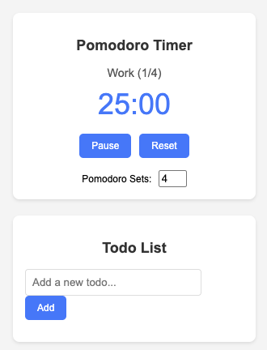

# PomodoTo ⏱️
*A minimalist Chrome extension that combines a Pomodoro timer with a todo list.*


## Features
- **Todo List** – Manage your tasks with a clean checkbox UI
- **Pomodoro Timer** – 25 min work / 5 min break
- **Background Timer** – Keeps running even if the popup is closed
- **Auto Cycling** – Loops through the specified number of sets
- **Alarm Sounds** – Notifies you when to switch sessions

## Screenshot


## Installation
1. Clone the repository:
   ```bash
   git clone https://github.com/NoCodeAIMaster/pomodoto.git
   ```
2. Open Google Chrome and navigate to `chrome://extensions`.
3. Enable "Developer mode" in the top right corner.
4. Click on "Load unpacked".
5. Select the cloned `pomodoto` directory.

**Tip:** You can replace `sounds/alarm.mp3` with any MP3 file you like.

## Usage
- **Set the number of Pomodoro sets:** Specify how many work/break cycles you want to complete.
- **Start:** Click the "Start" button to begin the first work session.
- **Pause/Resume:** You can pause the timer at any time and resume when you're ready.
- **Reset:** The "Reset" button stops the timer and resets the cycle.

## For Developers

### Repository Structure
```
.
├── background.js       # Service worker for background tasks (timer logic)
├── manifest.json       # Extension manifest file (V3)
├── offscreen.html/js   # Offscreen document for playing audio
├── popup.html/css/js   # UI and logic for the popup
├── images/             # Icons and screenshot
└── sounds/             # Sound files for alarms
```

### Development
- To reload the extension after making changes, go to `chrome://extensions` and click the reload button for the PomodoTo extension.

## Contributing
Pull requests are welcome! For major changes, please open an issue first to discuss what you would like to change.

## License
This project is licensed under the MIT License.
